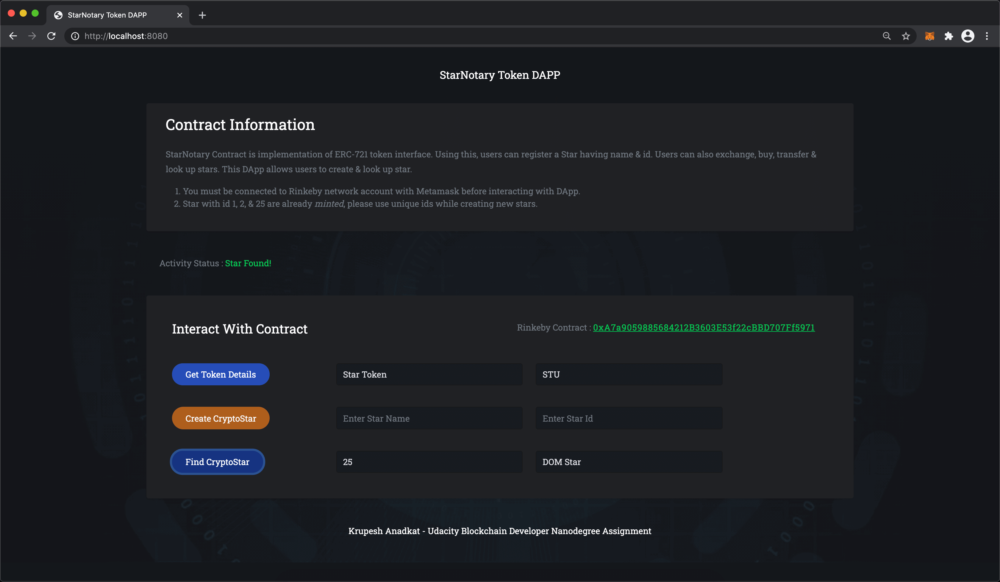
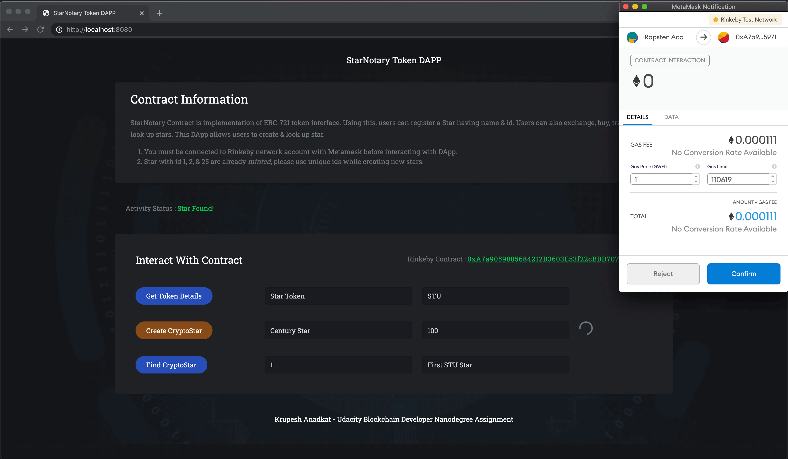

## CryptoStar Dapp - Blockchain Nanodegree Assignment

StarNotary Contract is implementation of ERC-721 token interface. Using this, users can register a Star having name & id. Users can also exchange, buy, transfer & look up stars. This DApp allows users to create & look up star.

1. You must be connected to Rinkeby network account with Metamask before interacting with DApp.
2. Star with id 1, 2, & 25 are already *minted*, please use unique ids while creating new stars.








#### 📜 Project Environment Information

| Entity                | Value                                      |
| --------------------- | :----------------------------------------- |
| Truffle               | v5.1.61                                    |
| OpenZeppelin-solidity | ^2.3.0                                     |
| Solidity              | v0.5.2                                     |
| Node                  | v14.12.0                                   |
| ERC-721 Token Name    | Star Token                                 |
| ERC-721 Token Symbol  | STU                                        |
| Rinkeby Token Address | 0xA7a9059885684212B3603E53f22cBBD707Ff5971 |


> Sensitive information has been removed from `truffle-config.js` file before adding code to GitHub.


#### 📌 Project Prerequisites

1. You must have Metamask installed in your browser.
2. You must have minimum 0.01 ETH of Rinkeby test network.


#### ⚙️ Project Setup

Please follow below steps to run the Dapp in your browser:

1. Clone the repository.
2. Open root directory of repository in terminal or Vscode.
3. Execute `npm install` in terminal in root directory to install contract related dependencies.
4. Go to `app` folder, execute `cd app` & execute `npm install` to install Dapp related dependencies.
5. Inside the `app` directory execute `npm run dev`, this will start dapp server at [http://localhost:8080](http://localhost:8080)
6. Open url in Metamask extension installed browser & connect Rinkeby account with dapp.
7. You can now interact with dapp.


#### 📂 Project Structure

```
.
├── FlatStarNotary.sol
├── Readme.md
├── app
│   ├── package-lock.json
│   ├── package.json
│   ├── src
│   │   ├── index.html
│   │   └── index.js
│   └── webpack.config.js
├── contracts
│   ├── Migrations.sol
│   └── StarNotary.sol
├── migrations
│   ├── 1_initial_migration.js
│   └── 2_deploy_contracts.js
├── package-lock.json
├── package.json
├── test
│   └── TestStarNotary.js
└── truffle-config.js
```

> FlatStarNotary.sol is composite file of all contracts created for Rinkeby Contract *Verification* process only.

***To verify & view contract on Rinkeby Etherscan, steps from below url were followed.***

https://forum.openzeppelin.com/t/how-to-verify-an-erc721-inheriting-from-openzeppelin/1062/2